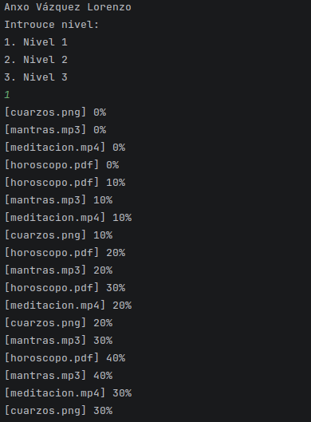
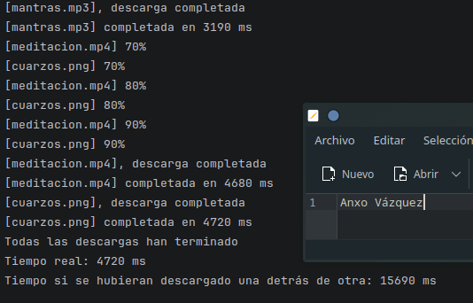
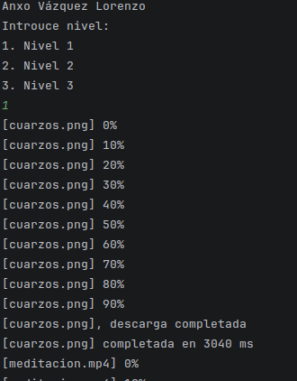
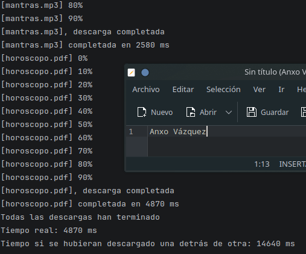
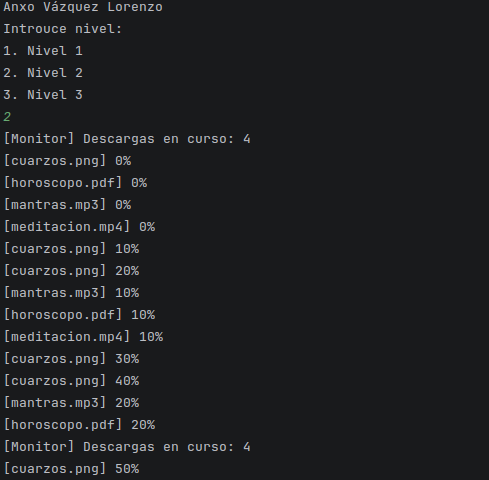
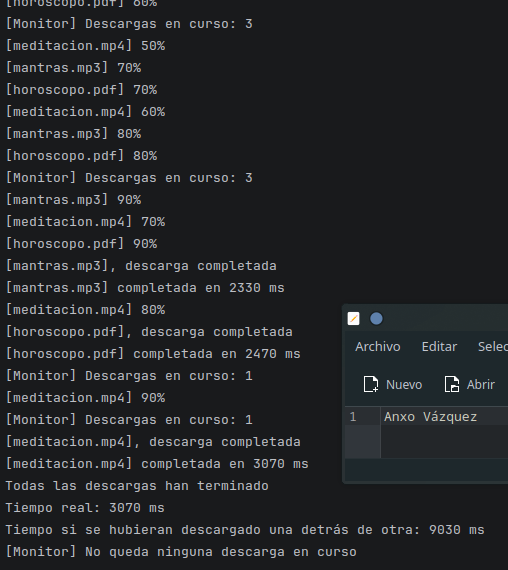
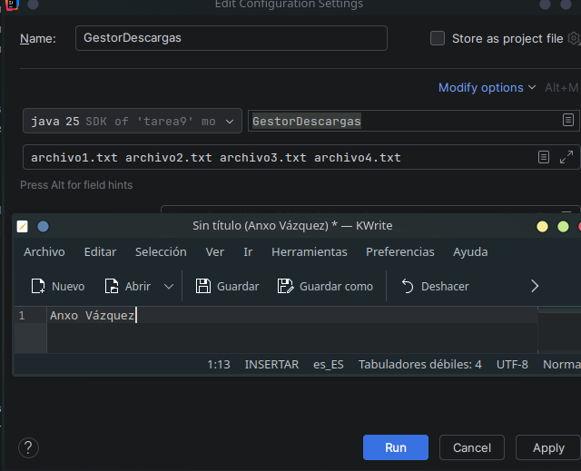
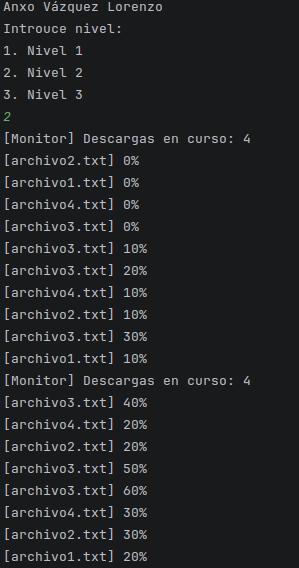
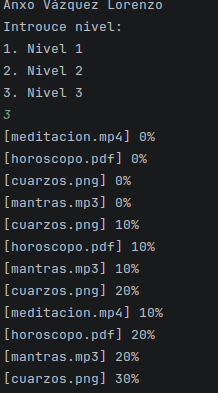
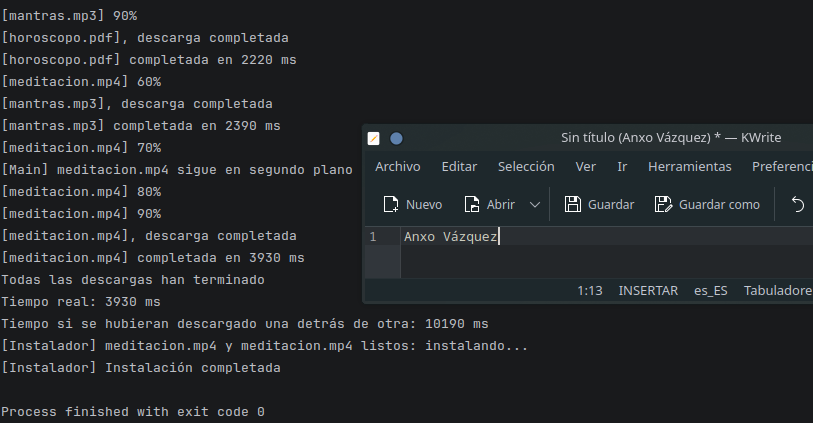

# Tarea 9 - Descargas Cuánticas: el gestor de Don Magufo

## Alumno

- Anxo Vázquez Lorenzo (2 DAM)

## Asignatura

- PSP

## Niveles hechos

**1, 2 y 3**

## Estructura del proyecto

- `GestorDescargas` -> Clase con la que interectúa el usuario mediante el `main`.

- `Monitor` -> Clase que monitorea las descargas mostrando descargas restantes cada `0.5 s`(nivel 2).

- `Instalador` -> Clase que simula la instalación de los archivos `meditacion.mp4` y `mantras.mp3`.

- `Descarga` -> Clase que simula las descargas de los archivos imprimiendo sus porcentajes de descarga y cuando están terminadas.

- `README` -> Aclaraciones código, errores cometidos, bibliografía, etc.

- `capturas` -> Capturas usadas en el `README`.

## Nivel 1

Usando la clase `Descarga` creo un array de descargas y las arranco:

```
descargas[0] = new Descarga("cuarzos.png");
            descargas[1] = new Descarga("meditacion.mp4");
            descargas[2] = new Descarga("mantras.mp3");
            descargas[3] = new Descarga("horoscopo.pdf");
```

```
for (Descarga d: descargas){
            d.start();
        }
```

A continuación calculo el tiempo que han tardado las descargas y muestro los datos:

```
//Cálculo de tiempo y espera de fin de las descargas
        int tiempoTotalDescargas =0;
        try {
            for (Descarga d: descargas){
                d.join();
                tiempoTotalDescargas += d.tiempoBloque * 10; //utilizo el tiempoBloque de cada descarga y lo multiplico por 10
            }
        } catch (InterruptedException e) {
            throw new RuntimeException(e);
        }

        // Mostrar información
        System.out.println("Todas las descargas han terminado");
        //Como las descarrgas se lanzan en hilos separados realmente sólo necesito saber cual es la que tarda más usando su propiedad tiempoBloque multiplicándolo por 10 (teniendo en cuenta las iteraciones)
        System.out.println("Tiempo real: " + calcularMayorTiempoBloque(descargas).tiempoBloque * 10 + " ms");
        System.out.println("Tiempo si se hubieran descargado una detrás de otra: " + tiempoTotalDescargas + " ms");
```

### Ejecución





### Respuestas

| Ejecución | Descarga más lenta | Tiempo real (ms) | Suma (ms) |
| :--- | :--- | :--- | :--- |
| 1 | horoscopo.pdf | 3660ms | 10700 ms |
| 2 | mantras.mp3 | 4170 ms | 12010 ms |
| 3 | mantras.mp3 | 2880 ms | 8320 ms |

- **¿Por qué el tiempo real es mucho menor que la suma?**

  Porque cada descarga se lanza en un hilo distinto y se ejecutan todas a la vez en lugar de una en una (lo que haría que tardase lo mismo que la suma).

- **¿Qué pasa si hacéis start() y join() dentro del mismo bucle? Probadlo y poned el tiempo real que os sale**

  Para probarlo modifico el bucle encargado de lanzar los `hilos`:

  ```
  //Start de las descargas
        for (Descarga d: descargas){
            d.start();
            try {
                d.join();
            }catch (InterruptedException e){
                throw new RuntimeException();
            }
        }
  ```
  
  Al lanzar el programa veo que los hilos se ejecutan de uno en uno en vez de hacerlo simultáneamente, ya que cada vez que arranca uno tiene que esperar a que termine.

  

  

## Nivel 2

En este nivel el usuario indica los 4 archivos, en caso que no los indique se utilizan los 4 de antes para ello compruebo de la siguiente forma:

```
Descarga[] descargas = new Descarga[4];
        if (nivel == 1 || nivel == 3 || (nivel == 2 && args.length != 4)) { //nivel 1 y 3 (o el 2 si el usuario no indica los 4 archivos por línea de comandos
            descargas[0] = new Descarga("cuarzos.png");
            descargas[1] = new Descarga("meditacion.mp4");
            descargas[2] = new Descarga("mantras.mp3");
            descargas[3] = new Descarga("horoscopo.pdf");
        }else{ //nivel 2
            descargas[0] = new Descarga(args[0]);
            descargas[1] = new Descarga(args[1]);
            descargas[2] = new Descarga(args[2]);
            descargas[3] = new Descarga(args[3]);
        }
```

A continuación se hace un `start` de los hilos y con `Monitor` compruebo las descargas restantes cada `500ms`:

```java
@Override
    public void run(){
        while(this.getNumeroDescargasVivas() != 0){ //mientras queden descargas en curso
            System.out.println("[Monitor] Descargas en curso: " + this.getNumeroDescargasVivas());
            try{
                Thread.sleep(500);
            } catch (InterruptedException e) {
                throw new RuntimeException(e);
            }

        }
        //Cuando no quedan más descargas
        System.out.println("[Monitor] No queda ninguna descarga en curso");
    }
```

Lo implemento así en `GestorDescargas`:

```
if(nivel == 2) {
            Monitor monitor = new Monitor("Monitor1", descargas);
            Thread thread = new Thread(monitor);
            thread.start();
        }
```

Después espero a que finalicen con `join()` y muestro los tiempos (al igual que el nivel 1).

### Ejecución

En caso de no indicar los archivos:





Para probar archivos personalizados por línea de comandos configuro desde el `IDE` que se ejecute con estos parámetros:





## Nivel 3

El método `run()` de `Instalador` espera a que los hilos hayan terminado para imprimir el proceso de instalación.

```java
@Override
    public void run(){
        for(Descarga d: this.descargas){
            try {
                d.join(); //espera a que los hilos hayan terminado
            } catch (InterruptedException e) {
                throw new RuntimeException(e);
            }
        }
        //una vez han finalizado:
        System.out.println("[Instalador] " + this.descargas[0].nombreArchivo + " y " + this.descargas[0].nombreArchivo + " listos: instalando...");
        System.out.println("[Instalador] Instalación completada");
    }
```

En el `main` de `GestorDescargas`, después de hacer un `start()` a todos los hilos, instancio un objeto `Instalador` y espero 3 segundos, si después de ese tiempo el hilo de `meditacion.mp4` sigue vivo imprimo al usuario una notificación.

```
if (nivel == 3) {
            Instalador instalador = new Instalador("Instalador", new Descarga[]{descargas[1], descargas[2]}); //meditacion y mantras
            instalador.start();
        }

        //Nivel 3
        if(nivel == 3) {
            try {
                //Espera 3 segundos y si el hilo de meditacion.mp4 (posicion 1 del array) sigue vivo imprime [Main] meditacionmp4 sigue en segundo plano
                Thread.sleep(3000);
                if (descargas[1].isAlive()) { //si sigue vivo
                    System.out.println("[Main] " + descargas[1].nombreArchivo + " sigue en segundo plano");
                }
            } catch (InterruptedException e) {
                throw new RuntimeException(e);
            }
        }
```

Después confirmo que el resto de hilos han terminado y muestro los tiempos al igual que `nivel 1`.

### Ejecución





## Errores encontrados

### Nivel 1

**Cálculo de tiempo real**

Después de pensar e investigar cuál era la mejor forma de calcular el tiempo real y ver varias alternativas, me acordé de que cada descarga se ejecuta en un hilo distinto, por lo tanto, como todas se ejecutan en paralelo, realmente solo necesito saber cuál fue la que más tardó (`tiempoBloque`).

Para ello utilizo esta función:

```java
    /**
     * Método que devuelve la descarga con mayor tiempo x bloque
     * @param descargas array de descargas
     * @return descarga con mayor tiempo x bloque
     */
    private static Descarga calcularMayorTiempoBloque(Descarga[] descargas) {
        int mayorTiempo = 0;
        Descarga descargaConMayorTiempo = new Descarga("");

        for(Descarga d: descargas){
            if (d.tiempoBloque > mayorTiempo){
                mayorTiempo = d.tiempoBloque;
                descargaConMayorTiempo = d;
            }
        }

        return descargaConMayorTiempo;
    }
```

Y la implemento así en mi código:

```
System.out.println("Tiempo real: " + calcularMayorTiempoBloque(descargas).tiempoBloque * 10 + " ms");
```

### Nivel 2

**Mostrar descargas activas**

Estuve pensando en varias formas para que el hilo `monitor` comprobase cada `0.5 s` la cantidad de descargas activas, finalmente decidí usar `isAlive()` para comprobar si seguían activas con esta función.

```java
private int getNumeroDescargasVivas(){
        int contador = 0;
        for(Descarga d: this.descargas){
            if(d.isAlive()){ //si el hilo sigue vivo suma 1 al contador
                contador++;
            }
        }
        return contador;
    }
```

La función anterior devuelve el número de descargas activas así que hasta que queden 0 compruebo cada `0.5s`:

```java
@Override
    public void run(){
        while(this.getNumeroDescargasVivas() != 0){ //mientras queden descargas en curso
            System.out.println("[Monitor] Descargas en curso: " + this.getNumeroDescargasVivas());
            try{
                Thread.sleep(500);
            } catch (InterruptedException e) {
                throw new RuntimeException(e);
            }

        }
        //Cuando no quedan más descargas
        System.out.println("[Monitor] No queda ninguna descarga en curso");
    }

```

### Nivel 3

En esta parte cometí varios errores esperando los `3s` de la descarga de `meditacion`, al final la forma más sencilla que encontré para resolverlo fue esperar a que `meditacion` terminase por delante del resto de hilos.

```
    //Nivel 3
          if(nivel == 3) {
            try {
                //Espera 3 segundos y si el hilo de meditacion.mp4 (posicion 1 del array) sigue vivo imprime [Main] meditacionmp4 sigue en segundo plano
                Thread.sleep(3000);
                if (descargas[1].isAlive()) { //si sigue vivo
                    System.out.println("[Main] " + descargas[1].nombreArchivo + " sigue en segundo plano");
                }
            } catch (InterruptedException e) {
                throw new RuntimeException(e);
            }
        }
        //Cálculo de tiempo y espera de fin de las descargas
        int tiempoTotalDescargas =0;
        try {
            for (Descarga d: descargas){
                d.join();
                tiempoTotalDescargas += d.tiempoBloque * 10; //utilizo el tiempoBloque de cada descarga y lo multiplico por 10
            }
        } catch (InterruptedException e) {
            throw new RuntimeException(e);
        }
```

## Bibliografía

- W3Schools - Generar números aleatorios

  https://www.w3schools.com/java/java_howto_random_number.asp

- Documentación Oracle - `Runnable y Thread`

  https://docs.oracle.com/en/java/javase/21/docs/api/java.base/java/lang/Runnable.html

  https://docs.oracle.com/en/java/javase/21/docs/api/java.base/java/lang/Thread.html

- Gemini - Generar tabla en Markdown

  Prompt: Recrea esta tabla en markdown para un Readme en Github (adjuntada foto de la tabla)

  Modificaciones: Ninguna en la tabla como tal, sólo rellené los campos con las respuestas
  
